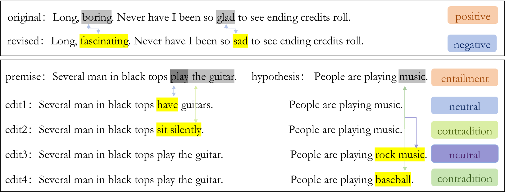

# Awesome CF Generation
This repository contains the frontier research on counterfactual generation which is a hot topic recently.  A counterfactual is obtained by making minimal or loose changes to existing data to flip their label for a particular NLP task. The counterfactually augmented data (CAD) consists of original data and counterfactuals, also called contrast sets (Gardner et al., 2020; Atanasova et al., 2022).

Here are some examples of counterfactuals based on sentiment analysis and natural language inference tasks.

 

### Reference
Matt Gardner, et al. Evaluating Models’ Local Decision Boundaries via Contrast Sets. In Findings of the Association for Computational Linguistics: EMNLP 2020, pages 1307–1323, Online. Association for Computational Linguistics.

Pepa Atanasova, et al. Fact Checking with Insufficient Evidence. Transactions of the Association for Computational Linguistics (TACL), 2022.

## Manual CF Generation
[Counterfactual story reasoning and generation](https://aclanthology.org/D19-1509.pdf),  EMNLP-IJCNLP 2019 (a controversy in overleaf？It is cited in *Human annotation* and *Traditional methods* Sections. )

[Learning the difference that makes a difference with counterfactually-augmented data](https://openreview.net/pdf?id=Sklgs0NFvr),  ICLR 2020 

[More bang for your buck: Natural perturbation for robust question answering](https://aclanthology.org/2020.emnlp-main.12.pdf), EMNLP 2020 

[People Make Better Edits: Measuring the Efficacy of LLM-Generated Counterfactually Augmented Data for Harmful Language Detection](https://aclanthology.org/2023.emnlp-main.649.pdf), EMNLP 2023 

[“Call me sexist, but...”: Revisiting Sexism Detection Using Psychological Scales and Adversarial Samples](https://arxiv.org/pdf/2004.12764.pdf), AAAI 2021

[Evaluating Models’ Local Decision Boundaries via Contrast Sets](https://aclanthology.org/2020.findings-emnlp.117.pdf), EMNLP finding 2020

## Automatic CF Generation
CF generation studies are relative to language models, such as traditional pre-trained models, e.g., Bert and Roberta, etc., or  large language models, e.g., gpt-3.5 and llama.

### Non-prompt based CF Generation
[LEWIS: Levenshtein editing for unsupervised text style transfer](https://arxiv.org/pdf/2105.08206) ACL 2021, sentiment transfer

[Unsupervised Text Style Transfer with Padded Masked Language Models](https://aclanthology.org/2020.emnlp-main.699.pdf) EMNLP 2020, sentiment transfer

[Politeness transfer: A tag and generate approach](https://aclanthology.org/2020.acl-main.169.pdf), ACL 2020, politeness style transfer

[Delete, Retrieve, Generate: A Simple Approach to Sentiment and Style Transfer](https://arxiv.org/pdf/1804.06437), NAACL 2018, sentiment transfer: attribution（sentiment-bearing words）  + replacement with retrieval texts

[Robustness to Spurious Correlations in Text Classification via Automatically Generated Counterfactuals](https://arxiv.org/pdf/2012.10040) AAAI 2021, casual score + dictionary replace

[Exploring the Efficacy of Automatically Generated Counterfactuals for Sentiment Analysis](https://aclanthology.org/2021.acl-long.26.pdf), ACL | IJCNLP 2021, dictionary casual identification + MLM replacement + SVM filter + Moverscore selection.

[Beyond Accuracy: Behavioral Testing of NLP Models with CheckList](https://aclanthology.org/2020.acl-main.442.pdf) 2020 ACL, template + dictionary generation

[Linguistically-informed transformations (LIT): A method for automatically generating contrast sets](https://arxiv.org/pdf/2010.08580) ACL 2020, parser+generation

[Polyjuice: Generating Counterfactuals for Explaining, Evaluating, and Improving Models](https://aclanthology.org/2021.acl-long.523.pdf), ACL 2021, template + generation

[Tailor: Generating and Perturbing Text with Semantic Controls](https://arxiv.org/pdf/2107.07150), ACL 2022, parser+generation

[A general search-based framework for generating textual counterfactual explanations](https://arxiv.org/pdf/2211.00369v2), AAAI 2024, search-based optimization: iterative mask-fill 

[Explaining Data-Driven Document Classifications](https://www.semanticscholar.org/paper/Explaining-Data-Driven-Document-Classifications-Martens-Provost/add9930a368c1f281a1428d09ba65751edf06555), MIS Quarterly 2014, search-based rationals identification and delete

[Generate Your Counterfactuals: Towards Controlled Counterfactual Generation for Text](https://cdn.aaai.org/ojs/17594/17594-13-21088-1-2-20210518.pdf),  AAAI 2021,  steer internal states 

[Generating Realistic Natural Language Counterfactuals](https://aclanthology.org/2021.findings-emnlp.306.pdf),  EMNLP finding 2021, find perturbation in latent space

[Explaining NLP Models via Minimal Contrastive Editing (MiCE)](https://aclanthology.org/2021.findings-acl.336.pdf), ACL finding 2021,  attribution + generation

[Relevance-based Infilling for Natural Language Counterfactuals](https://dl.acm.org/doi/10.1145/3583780.3615029) CKLM 2023, improved version of MiCE

[Kace-Generating Knowledge-Aware Contrastive Explanations for Natural Language Inference](https://aclanthology.org/2021.acl-long.196.pdf),  ACL 2021, rationals + controllable LM

[CREST: A Joint Framework for Rationalization and Counterfactual Text Generation](https://arxiv.org/pdf/2305.17075), ACL 2023, rationals mask + fill

[NeuroCounterfactuals: Beyond Minimal-Edit Counterfactuals for Richer Data Augmentation](https://aclanthology.org/2022.findings-emnlp.371.pdf),  EMNLP finding 2022, concept + CLM

[Counterfactual Explanation Based on Gradual Construction for Deep Networks](https://arxiv.org/pdf/2008.01897.pdf) PR 2022, CCFB, mask-infill: important features and CLM fill.

[AutoCAD: Automatically Generate Counterfactuals for Mitigating Shortcut Learning](https://aclanthology.org/2022.findings-emnlp.170.pdf) EMNLP finding 2022, mask-infill: attribution and CLM fill

[Retrieval-guided Counterfactual Generation for QA](https://aclanthology.org/2022.acl-long.117.pdf), ACL 2022, retrivel context + open-generation

[Entity-based knowledge conflicts in question answering](https://aclanthology.org/2021.emnlp-main.565.pdf), EMNLP 2021, retrivel context + entity-based Substitutions

[EXPLAIN, EDIT, GENERATE: Rationale-sensitive counterfactual data augmentation for multi-hop fact verification](https://aclanthology.org/2023.emnlp-main.826.pdf), EMNLP 2023, casual modeling generation： rationals + open-generation

[Counterfactual generation with identifiability guarantees](https://arxiv.org/pdf/2402.15309), NeurIPS 2023, casual modeling generation: sentiment style transfer

[A causal lens for controllable text generation](https://arxiv.org/pdf/2201.09119), NeurIPS 2021, casual modeling generation: text attribution transfer

[Improving Classifier Robustness through Active Generation of Pairwise Counterfactuals](https://arxiv.org/pdf/2305.13535.pdf), EMNLP finding 2023, a strategy observing a more robust CF Labeler.  

### Prompt based CF Generation
[Llms as counterfactual explanation modules: Can chatgpt explain black-box text classifiers?](https://arxiv.org/pdf/2309.13340v1.pdf), AAAI 2024(update url, Todo) 

[DISCO: Distilling Counterfactuals with Large Language Models](https://aclanthology.org/2023.acl-long.302.pdf),  ACL 2023 

[Faithful Explanations of Black-box NLP Models Using LLM-generated Counterfactuals](https://arxiv.org/pdf/2310.00603v2.pdf), ICLR 2024

[CATfOOD: Counterfactual Augmented Training for Improving Out-of-Domain Performance and Calibration](https://aclanthology.org/2024.eacl-long.113.pdf), EACL 2024

[Explore Spurious Correlations at the Concept Level in Language Models for Text Classification](https://arxiv.org/pdf/2311.08648.pdf) arxive 2023 ( Undo in overleaf: Detect the spurious correlation between concept and label, and simply propose to use cfs to alleviate spurious.)

[A Novel Counterfactual Data Augmentation Method for Aspect-Based Sentiment Analysis](https://arxiv.org/pdf/2306.11260.pdf), ACML 2023

[CORE: A Retrieve-then-Edit Framework for Counterfactual Data Generation](https://arxiv.org/pdf/2210.04873.pdf), EMNLP finding 2022
